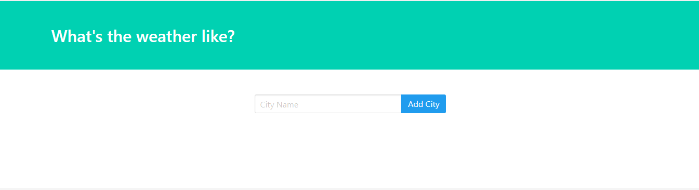
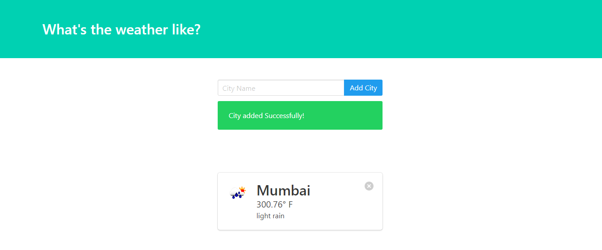
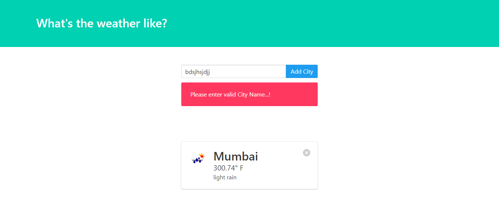
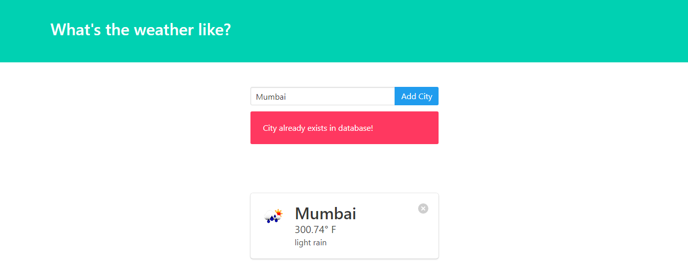

# Weather-App
This is weather app developed using django.

## About Repository
This is app developed in python using django framework. Django is a famous python framework which is used to develop web applications. Weather app is one of those applications developed by using django. It uses open weather api which gives live weather conditions of city. The data is updated in every 10 minutes.<br>
This repository contains all the code and files required to build Weather app.

## Installation

- Clone the repository

```bash
git clone https://github.com/Omkar-Atugade/Weather-App.git
```

- Install Dependencies

```bash
cd Weather-App
pip install -r requirements.txt
```

- Create a file names `.env` in the folder where your `settings.py` file is present. Enter following information in your .env file

```
SECRET_KEY=<your_secret_key>
```

- Run django migrations

```bash
python manage.py migrate
```

- Run django server

```bash
python manage.py runserver
```


## Snippets
 <p align='center'>
  
  </p>
 <br>
 <br>
 <p align='center'>
  
  </p>
  
 <br>
 <br>
 
 <p align='center'>
  
  </p>
  <br>
 <br>
 
 <p align='center'>
  
  </p>

## About Me:
Omkar Atugade,<br>
Mumbai, Maharashtra, India.

## Find me on :
[Instagram](https://www.instagram.com/omi_atugade/)<br>
[Twitter](https://www.twitter.com/@AtugadeOmkar)
